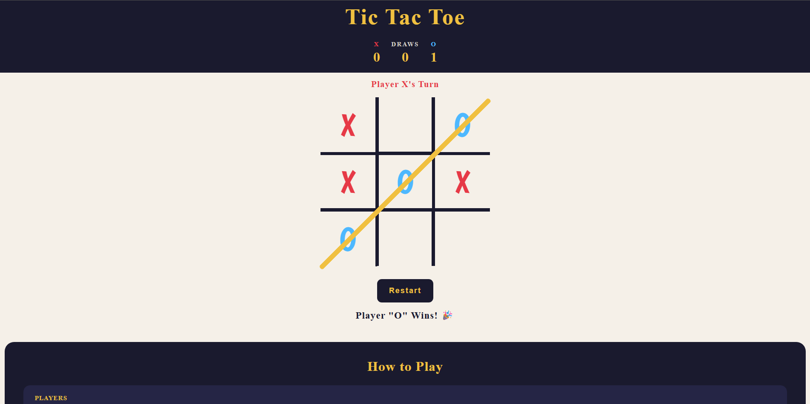

# Tic Tac Toe 🎮

A classic two-player Tic Tac Toe game built with vanilla HTML, CSS, and JavaScript.

## Demo

> Open `index.html` in any browser to play.

## Features

- Two-player gameplay (X and O)
- Live turn indicator showing whose move it is
- Score tracker that persists across multiple rounds
- Win detection — rows, columns, and diagonals
- Animated gold strike-through line on win
- Pop animation when placing X or O
- On-page win and draw messages (no alerts)
- Restart button that resets the board without losing scores
- Rules section explaining how to play
- Responsive layout for mobile screens
- Clean navy + gold color theme

## How to Play

1. Player **X** always goes first
2. Take turns clicking an empty cell on the 3×3 grid
3. First player to get **3 in a row** wins — horizontally, vertically, or diagonally
4. If all 9 cells are filled with no winner, it's a **draw**
5. Click **Restart** to reset the board and play again — scores are kept!

## Project Structure

```
tic-tac-toe/
├── index.html       # Game layout and structure
├── style.css        # Styling and theme
└── script.js        # Game logic
```

## Tech Stack

- HTML5
- CSS3
- JavaScript (Vanilla)
- Google Fonts — [Boogaloo](https://fonts.google.com/specimen/Boogaloo)

## Screenshots

> 

## Getting Started

No installation needed. Just clone the repo and open the file:

```bash
git clone https://github.com/ashutosht0210/Tic-Tac-Toe.git
cd Tic-Tac-Toe
open index.html
```

## Future Improvements

- [ ] Single player mode vs computer (AI)
- [ ] Sound effects on place and win
- [ ] Choose who goes first before game starts
- [ ] Animations on win message

## License

This project is open source and available under the [MIT License](LICENSE).
